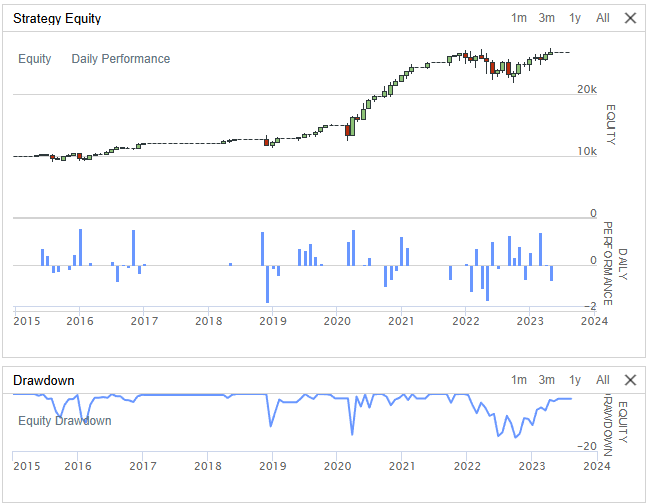

# Harmonic Pattern Trading

A small project drawing harmonics, trendlines and then backtesting them in QuantConnect.


## What's This About

Harmonic patterns are price structures based on Fibonacci ratios. The idea is that markets tend to retrace and extend at specific Fibonacci levels, creating predictable XABCD patterns.

So the goal:
1. Build a detector that finds these patterns automatically
2. Visualize them in real-time
3. Actually test if trading them makes money

## Project Structure

```
harmonics_clean/          # Standalone proof of concept
   main.py               # Animated visualization
   harmonics.py          # Pattern detection algorithm
   trendlines.py         # Support/resistance detection

harmonics.py              # QuantConnect version
levels.py                 # Market level detection (KDE-based)
backtest.png              # Backtest results
```

## The Visualization

An animated candlestick chart that shows:
- **XABCD patterns** in blue with Fibonacci ratio labels
- **Support lines** in green, **resistance** in red
- **Pattern classification** (wedges, channels, triangles)

Run it:
```bash
cd harmonics_clean
pip install -r requirements.txt
python main.py
```

Click anywhere to pause/resume.

### Patterns Detected

| Pattern    | XB          | AC          | BD          | XD          |
|------------|-------------|-------------|-------------|-------------|
| Gartley    | 0.618       | 0.382-0.886 | 1.13-1.618  | 0.786       |
| Bat        | 0.382-0.50  | 0.382-0.886 | 1.618-2.618 | 0.886       |
| Butterfly  | 0.786       | 0.382-0.886 | 1.618-2.24  | 1.27-1.41   |
| Crab       | 0.382-0.618 | 0.382-0.886 | 2.618-3.618 | 1.618       |
| Deep Crab  | 0.886       | 0.382-0.886 | 2.0-3.618   | 1.618       |
| Cypher     | 0.382-0.618 | 1.13-1.41   | 1.27-2.00   | 0.786       |

These are standard patterns.

One thing to note, from analyze.py, is that when SPY is analyzed, harmonics generate these results:

Avg return by hold period (%)
Direction    |      3d |      6d |      9d |     12d |     15d
------------------------------------------------------------
Bullish      |   0.34% |   0.73% |   1.25% |   1.46% |   1.97% |
Bearish      |   0.29% |  -0.28% |  -0.67% |  -1.12% |  -1.14% |

So basically, every time harmonics pattern is visible and it's bullish and you buy, then you will get on average 2% in 2 weeks. 

But if you short bearish patterns, then you're losing, so it probably reflects the fact that SPY is always rising.


## Backtest

Tested on QuantConnect - enter when a harmonic pattern completes at point D, expecting a reversal.



[View full backtest on QuantConnect](https://www.quantconnect.cloud/backtest/1649becd4d2b14111f4206501671a13a/?theme=chrome)

### Results

Not so good. Lots of time off-market, also it gets complex very fast, there are so many rules that can be made. Figuring out where to put stops, take profit, when to enter, exit is a pain in one round place. If optimization would be done, then it would probably be overfitting, let's be real. But for the sake of visuals it is great. I love it.

## How It Works

### Pattern Detection
1. **Zigzag** - Find significant price pivots
2. **XABCD Extraction** - Take the last 5 pivot points
3. **Ratio Calculation** - Compute Fibonacci ratios between legs
4. **Pattern Matching** - Compare against known patterns, pick best match

### Trendline Detection
1. Fit a line through close prices
2. Find upper pivot (resistance) and lower pivot (support)
3. Optimize slopes to minimize error
4. Classify: wedge, channel, triangle, etc.